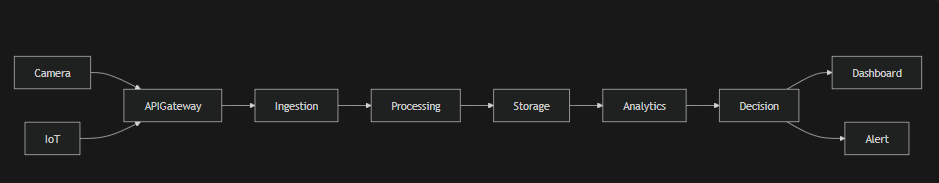
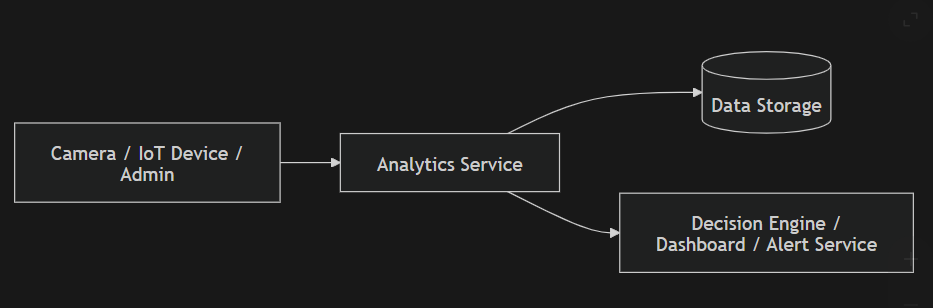
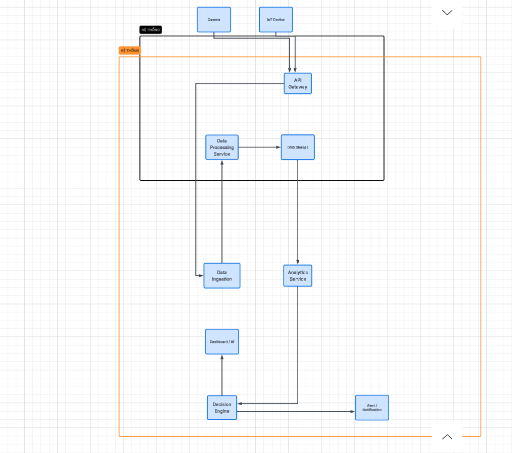

# Service Boundary của nhóm

## 1. Thông tin nhóm

- Tên nhóm: Nhóm 6b
- Lớp: CNTT 17-10
- Thành viên: Trần Công Quân
- Service nhóm phụ trách: analytics
- Sản phẩm tổng thể của lớp:  dây dựng dịch vụ tổng hợp và phân tích dữ liệu

## 2. Actor

Ai tương tác với hệ thống/service?
Bên ngoài:
Người dùng, thiết bị (camera, iot)
Bên trong:
API Gateway (điểm vào hệ thống)
Các service nội bộ (processing, analytics, decision,...)
## 3. System Boundary

Nhóm em xây phần nào?
API Gateway
Data Ingestion
Data Processing Service
Data Storage
Analytics Service
Decision Engine
Dashboard / UI
Alert / Notification

Phần nhóm kiểm soát:

- API Gateway
Data Ingestion
Data Processing Service
Data Storage
Analytics Service
Decision Engine
Dashboard / UI
Alert / Notification

Phần nhóm chỉ tích hợp:

- Camera
IoT Device

## 4. Service Boundary

Service của nhóm có trách nhiệm gì?
Phân tích dữ liệu từ Data Storage
Tính toán:
mật độ
xu hướng
phát hiện bất thường
Gửi kết quả sang:
Decision Engine

Service KHÔNG làm gì?
Không ingest dữ liệu trực tiếp từ thiết bị
Không lưu trữ dữ liệu thô
Không hiển thị UI
Không gửi notification trực tiếp

## 5. Input / Output

### Input

- Dữ liệu đã xử lý từ Data Storage:
dữ liệu camera (frame/features)
dữ liệu IoT (sensor values)

### Output

- Kết quả phân tích:

thống kê
cảnh báo bất thường
insight

## 6. API dự kiến

| Method | Endpoint  | Mục đích |
|GET | /health       | Kiểm tra service |
|POST| /analyze      | Phân tích dữ liệu |
|GET |/result        |Lấy kết quả phân tích|
|GET |/metrics       |Lấy số liệu thống kê|
|POST|/detect-anomaly|Phát hiện bất thường|

## 7. Phụ thuộc service khác

Service này gọi đến service nào?
Data Storage (lấy dữ liệu)

Service nào gọi đến service này?
Decision Engine (lấy kết quả phân tích)
Dashboard (hiển thị dữ liệu)

## 8. Sơ đồ minh họa

Có thể vẽ bằng Mermaid, draw.io, Ludichart hoặc ảnh chụp sơ đồ.


```mermaid

flowchart LR
    User[Actor] --> Service[Service của nhóm]
    Service --> DB[(Database)]
    Service --> Other[Service khác]
